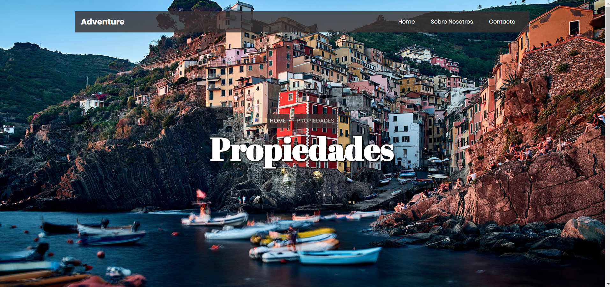
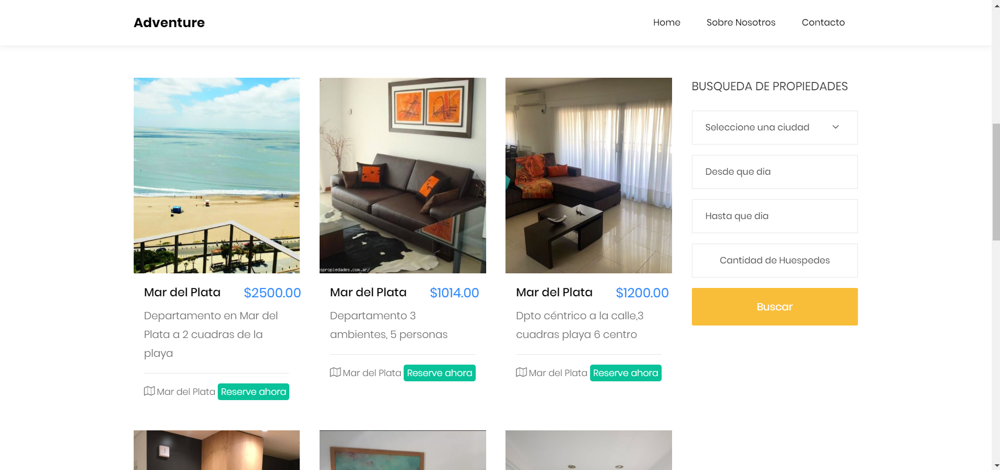
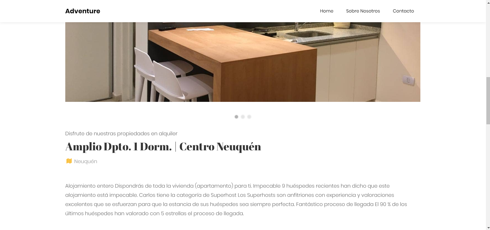
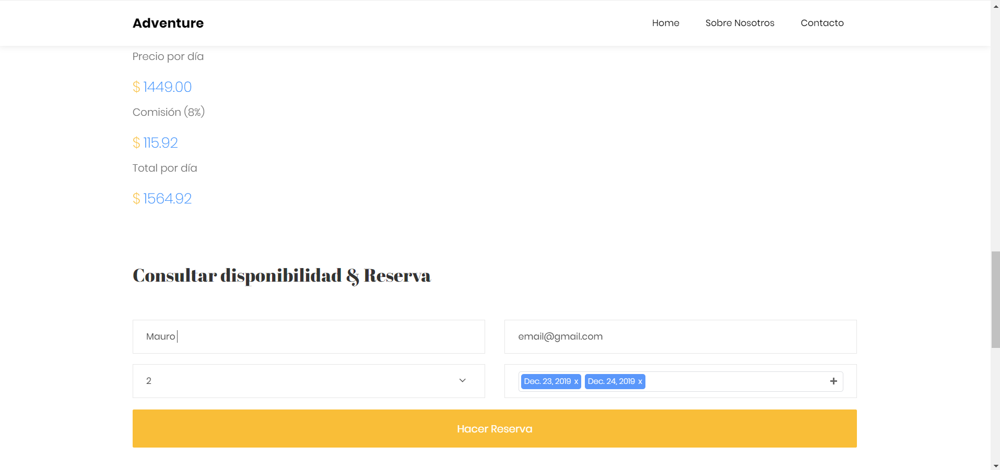
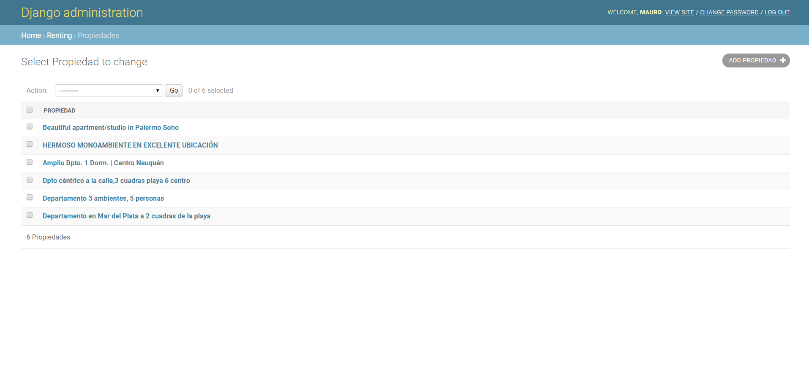
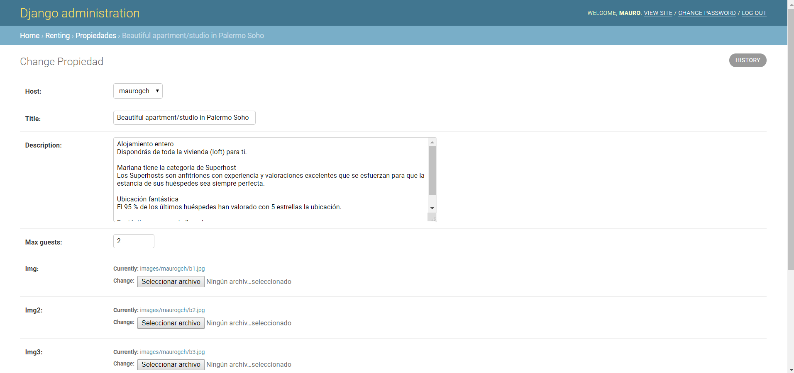

# airvnv
Project for the subject "Systems Metodology 3" for the degree "University Technician in Informatic Sytems".

## Configuration

- Create virtual enviramoent with requirements in "requirements.txt"
- No need to make a migration, as db.sqlite3 is present with data loaded
    - In case of creating new database:
    - Run "python manage.py makemigrations renting"
    - Run "python manage.py migrate"
    - Load fixture data, Run "python manage.py loaddata dbauth.json" and "python manage.py loaddata dbrenting.json"
- Run "python manage.py runserver" or run it with pycharm

## Use

- Admin page in localhost/admin
    - Admin user: admin
    - Admin pass: admin
    - Host user: maurogch
    - Host pass: metodologia2019
- Admin page as a host user lets you load properties and rent dates
- Index shows properties load, with filters for city, dates, and min guests
- Single property pages show more info and lets you make a reservation

## Demo Images

- Home

- Index Properties

- Single Property Description

- Single Property Reservation

- Admin Page

- Admin Edit Property

